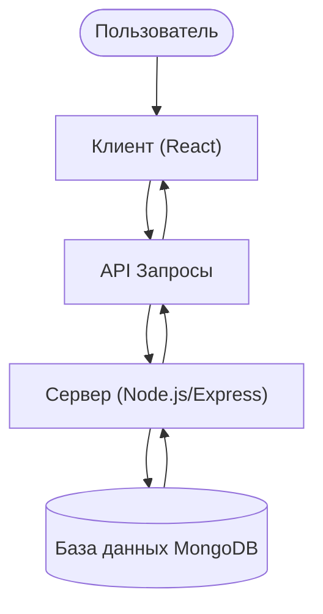

### StudyConnect

StudyConnect — это полнофункциональное веб-приложение, разработанное на стеке MERN, предназначенное для соединения студентов с репетиторами для академической помощи. Проект обеспечивает удобный интерфейс для поиска, бронирования занятий и управления профилем, а также систему аутентификации и управления данными пользователей и репетиторов.

### Обзор Проекта

StudyConnect предоставляет платформу для:
*   **Пользователей:** Регистрация, вход, поиск репетиторов по предметам, бронирование занятий, управление бронированиями, просмотр истории занятий, редактирование профиля и настроек аккаунта, добавление отзывов.
*   **Репетиторов:** (Предполагается, что есть функционал для репетиторов, хотя в предоставленном контексте он не детализирован, но есть данные о репетиторах в БД).

### Технологический Стек

Проект построен на современном JavaScript-стеке:

*   **Backend (Сервер):**
    *   **Node.js:** Среда выполнения JavaScript.
    *   **Express.js:** Веб-фреймворк для создания API.
    *   **MongoDB:** NoSQL база данных для хранения данных пользователей, репетиторов и бронирований.
    *   **Mongoose:** ODM (Object Data Modeling) библиотека для MongoDB и Node.js.
    *   **Passport.js:** Middleware для аутентификации (используется `passport-local` для локальной стратегии).
    *   **`crypto` (Node.js built-in):** Для хеширования паролей (`pbkdf2Sync`).
    *   **`dotenv`:** Для управления переменными окружения.
    *   **`morgan`:** HTTP request logger middleware.
    *   **`cookie-parser`, `express-session`:** Для управления сессиями и куками.
    *   **`multer`, `cloudinary`:** Для загрузки и хранения изображений (предполагается для профилей).
*   **Frontend (Клиент):**
    *   **React:** JavaScript-библиотека для построения пользовательских интерфейсов (инициализирован через Create React App).
    *   **React Router DOM:** Для клиентской маршрутизации.
    *   **React Icons, Font Awesome:** Для иконок.
    *   **Bootstrap:** Для стилизации и адаптивного дизайна.
    *   **CSS Modules/Global CSS:** Для стилизации компонентов.
*   **Инструменты Разработки:**
    *   **Nodemon:** Для автоматического перезапуска сервера при изменениях.
    *   **ESLint, Prettier:** Для обеспечения качества и единообразия кода.
    *   **NPM:** Менеджер пакетов.

### Архитектура

Проект использует архитектуру MERN, где клиентская часть (React) взаимодействует с серверной частью (Node.js/Express.js) через RESTful API, а сервер, в свою очередь, взаимодействует с базой данных MongoDB.



### Установка и Запуск

Для локального развертывания проекта выполните следующие шаги:

1.  **Клонируйте репозиторий:**
    ```bash
    git clone https://github.com/Sorelim/StudyConnect-.git
    cd StudyConnect-
    ```
2.  **Установите зависимости:**
    *   Перейдите в корневую директорию проекта (`StudyConnect/`).
    *   Выполните `npm install` (это также установит зависимости для клиентской части и выполнит сборку).
3.  **Инициализируйте базу данных (MongoDB):**
    *   Убедитесь, что у вас установлен и запущен MongoDB.
    *   Выполните `npm run initDB` для импорта данных репетиторов в вашу локальную базу данных MongoDB. Это создаст базу данных `StudyConnect` с коллекцией `tutors`.
4.  **Запустите сервер:**
    *   В корневой директории проекта (`StudyConnect/`) выполните `npm run dev` для запуска сервера в режиме разработки (на порту 5001).
5.  **Запустите клиентское приложение:**
    *   Перейдите в директорию клиента (`cd StudyConnect/client`).
    *   Выполните `npm start` для запуска React-приложения в режиме разработки (на порту 3000).

Приложение будет доступно по адресу `http://localhost:3000`.

### Структура Проекта

*   `StudyConnect/`: Корневая директория серверной части и общих конфигураций.
    *   `controllers/`: Логика обработки запросов для API.
        *   `utils/passwordUtilites.js`: Утилиты для хеширования и проверки паролей.
    *   `db/data/tutors2.json`: Файл с начальными данными для репетиторов.
    *   `routers/`: Определение маршрутов API (например, `classHistory.js` для добавления отзывов).
    *   `server.js`: Главный файл сервера, инициализация Express, подключение middleware и маршрутов.
    *   `package.json`: Зависимости и скрипты для серверной части.
    *   `LICENSE`: Лицензия проекта.
    *   `README.md`: Инструкции по запуску всего проекта.
*   `StudyConnect/client/`: Корневая директория клиентской части React-приложения.
    *   `public/`: Статические файлы (HTML, манифест, иконки).
        *   `index.html`: Основной HTML-файл приложения.
    *   `src/`: Исходный код React-приложения.
        *   `App.js`: Главный компонент приложения, определяющий маршруты.
        *   `index.js`: Точка входа React-приложения.
        *   `assets/`: Статические ресурсы (изображения, стили).
            *   `styles/`: CSS-файлы для различных компонентов и страниц.
        *   `components/`: Переиспользуемые React-компоненты (например, `Navbar`, `Footer`, `Login`, `Register`, `TutorProfile`, `SearchTutor`).
        *   `pages/`: Компоненты, представляющие целые страницы приложения (например, `LoginPage`, `RegisterPage`, `Landing`, `Profile`, `BookClass`, `AccountSettingPage`, `ManageBookingPage`, `ClassHistoryPage`).
        *   `utils/`: Вспомогательные утилиты и контексты (например, `auth.js` для контекста аутентификации).
    *   `package.json`: Зависимости и скрипты для клиентской части.
    *   `README.md`: Документация Create React App.
    *   `.gitignore`: Файлы и директории, игнорируемые Git.

### Ключевые Функции

*   **Аутентификация и Авторизация:** Регистрация, вход в систему, управление сессиями с использованием Passport.js. Пароли хешируются с использованием `crypto.pbkdf2Sync` для безопасности.
*   **Управление Профилем:** Просмотр и редактирование пользовательских профилей.
*   **Поиск Репетиторов:** Возможность поиска репетиторов (предполагается по предметам или другим критериям).
*   **Бронирование Занятий:** Функционал для бронирования занятий с репетиторами.
*   **История Занятий:** Просмотр прошлых занятий и возможность добавления отзывов.
*   **Настройки Аккаунта:** Управление настройками учетной записи.
*   **Ленивая Загрузка (Lazy Loading):** Использование `React.lazy` и `React.Suspense` для оптимизации загрузки компонентов (`SearchTutor`, `TutorInfo`).

### API Эндпоинты (Примеры)

Сервер предоставляет RESTful API для взаимодействия с клиентской частью. Примеры маршрутов:

*   `POST /api/addReview`: Добавление отзыва к репетитору.
*   Предполагаются также эндпоинты для:
    *   Аутентификации (`/api/login`, `/api/register`)
    *   Управления пользователями (`/api/profile`, `/api/editProfile`, `/api/accountSetting`)
    *   Поиска и получения информации о репетиторах (`/api/tutors`, `/api/searchTutor`)
    *   Управления бронированиями (`/api/book`, `/api/manageBooking`)
    *   Получения истории занятий (`/api/classHistory`)

### Клиентские Маршруты (React Router DOM)

Приложение использует React Router DOM для навигации:

*   `/`: Главная страница (`Landing`).
*   `/login`: Страница входа (`LoginPage`).
*   `/register`: Страница регистрации (`RegisterPage`).
*   `/book`: Страница бронирования занятий (`BookClass`).
    *   `/book/:subject`: Вложенный маршрут для просмотра профиля репетитора по предмету (`TutorProfile`).
    *   `/book/:tutorId`: Вложенный маршрут для просмотра информации о конкретном репетиторе (`LazySearch2`).
*   `/profile`: Страница профиля пользователя (`Profile`).
*   `/profile/editProfile`: Страница редактирования профиля (`EditProfilePage`).
*   `/profile/manageBooking`: Страница управления бронированиями (`ManageBookingPage`).
*   `/profile/classHistory`: Страница истории занятий (`ClassHistoryPage`).
*   `/profile/accountSettings`: Страница настроек аккаунта (`AccountSettingPage`).
*   `/searchTutor`: Страница поиска репетиторов (`LazySearch`).
*   `*`: Страница 404 Not Found (`NotFound`).

### Аутентификация

Аутентификация реализована с использованием `passport-local` стратегии. Пароли пользователей хешируются с использованием `crypto.pbkdf2Sync` с солью, что обеспечивает надежное хранение учетных данных.

### База Данных

Проект использует MongoDB. Инициализация базы данных с начальными данными репетиторов осуществляется через скрипт `npm run initDB`, который импортирует `tutors2.json` в коллекцию `tutors` базы данных `StudyConnect`.

### Лицензия

Проект распространяется под лицензией [MIT License](StudyConnect/LICENSE).
